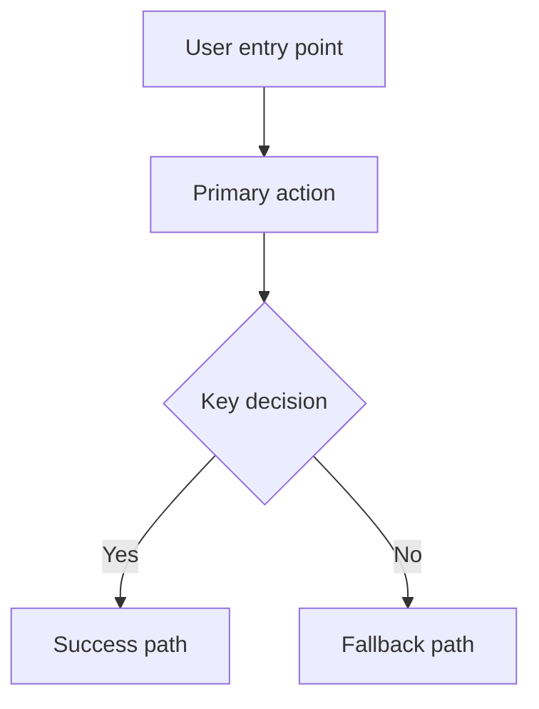

# PRD Reference Guide

This guide is for writing stage-aware, nearly-build-ready Product Requirement Documents (PRDs) for `{Company XYZ}` features.

The bias is toward clarity over completeness. A strong PRD should help a stakeholder understand the bet quickly, help a delivery team turn scope into backlog work, and avoid pretending every feature needs the same document weight.

For worked examples, see:
- `examples/example-prd-internal-tool.md`
- `examples/example-prd-customer-facing.md`

## Core Principles

A strong PRD should:
- explain the user job and why it matters now
- define the stage of the product clearly
- show where the feature fits in the existing product or platform
- capture the few requirements and journeys that actually shape scope
- define success in measurable terms
- be specific enough that backlog creation can flow from the functional requirements without dropping into user stories and acceptance criteria

Avoid:
- long narrative sections
- repeated material across multiple headings
- backlog detail and detailed acceptance criteria
- market or competitive padding that does not change a decision
- describing mechanisms before clarifying the underlying objective

## Jobs To Be Done First

Use Jobs to Be Done as a first-principles lens throughout the PRD.

The core rule:
- focus on what the user is trying to achieve
- avoid over-focusing on the mechanism used to achieve it

Good framing:
- `save for a future life event`
- `get a customer case to the right owner quickly`
- `understand whether progress is on track`

Weak framing:
- `earn interest on savings`
- `turn on round-ups`
- `apply routing rules`

Throughout the document, keep asking:
- what job is the user hiring this product to do?
- how are they getting that job done today?
- what is frustrating, fragile, or incomplete about the current approach?
- what progress should this product make easier?

If market or research context is included, frame it around the job:
- how are users currently getting the job done?
- what substitutes, workflows, or hacks are they using?
- what trade-offs do they accept today?
- which part of the job remains underserved?

## Choose The PRD Phase

Not every PRD needs the same depth. Pick the phase first.

| PRD Phase | Use When | Default Bias |
| --- | --- | --- |
| `MVP` | Defining the smallest build-worthy slice | Tight scope, P0 requirements, one main journey, key risks |
| `MMP` | Expanding from viability into a more marketable release | More business context, clearer rollout gates, fuller supporting journeys |
| `MLP` | Raising the quality bar so the experience feels lovable, trusted, or differentiated | More explicit UX quality, emotional moments, and polish criteria |
| `Enhancement` | Extending a stable product or platform incrementally | Focus on what changes, what it touches, what must not break |

Phase guidance:
- `MVP` should stay lean. If a section does not change scope or sequencing, cut it.
- `MMP` can add market, competitive, or continuation material when it changes prioritization.
- `MLP` should add quality expectations, not just more requirements.
- `Enhancement` should reference the existing product state rather than restating the whole product from scratch.

## Track The Document Status

Keep `PRD Phase` and `Document Status` separate.

- `PRD Phase` describes the maturity of the product bet: `MVP`, `MMP`, `MLP`, or `Enhancement`.
- `Document Status` describes the maturity of the document and delivery effort.

Use these document statuses:

| Document Status | Use When |
| --- | --- |
| `Ideating` | The problem, job, and scope are still being shaped. Open questions are expected. |
| `Reviewing` | The proposed scope is ready for cross-functional critique and decision-making. |
| `Building` | The team is actively implementing against the PRD and updating it as decisions land. |
| `In Production` | The feature is live, and the PRD now serves as a record of shipped intent, learnings, and follow-on opportunities. |

## Suggested Structure

Most PRDs in this repo should use this structure:

1. `TL;DR`
2. `Product Shape`
3. `Strategic Context`
4. `Goals & Rabbit Holes`
5. `Functional Requirements`
6. `Entry Points, Core Journey & Platform Fit`
7. `Success Metrics & Gates`
8. `Systems, Risks & Compliance`

Optional add-ons:
- `AI Role, Guardrails & Failure Modes`
- `AI Evaluation & Rollout`
- `Detailed Flow Table`
- `Migration Notes`

Use optional sections only when they materially improve decision-making.

## Phase By Section

| Section | `MVP` | `MMP` | `MLP` | `Enhancement` |
| --- | --- | --- | --- | --- |
| `TL;DR` | Required | Required | Required | Required |
| `Product Shape` | Required | Required | Required | Required |
| `Strategic Context` | Required, lean | Required, fuller | Required, fuller | Required, focused on delta |
| `Goals & Rabbit Holes` | Required | Required | Required | Required |
| `Functional Requirements` | P0-heavy | P0 and select P1 | P0, P1, quality bars | Only changed or newly relevant areas |
| `Entry Points, Core Journey & Platform Fit` | Required | Required | Required | Required |
| `Success Metrics & Gates` | 3-5 metrics | 4-6 metrics plus gates if needed | 4-6 metrics plus quality measures | Delta metrics and guardrails |
| `Systems, Risks & Compliance` | Required | Required | Required | Required with regression focus |
| `Strategic Context` sub-sections for market, competitors, and substitutes | Optional | Usually useful for customer-facing work | Usually useful | Only if they change the case |
| `AI Role, Guardrails & Failure Modes` | Only for AI-enabled work | Only for AI-enabled work | Usually useful for AI-enabled work | Only if the change affects AI behavior |
| `AI Evaluation & Rollout` | Only for AI-enabled work | Usually useful for AI-enabled work | Usually useful for AI-enabled work | Only if the change affects AI behavior |
| `Detailed Flow Table` | Only if ambiguity is high | Only if ambiguity is high | Use selectively | Only for changed flows |

## Document Header

Use a simple header:

```markdown
# [Feature Name]

Author: [Name]
Document Version: [Version Number]
Document Status: [Ideating | Reviewing | Building | In Production]
Document Type: PRD
```

Keep `PRD Phase`, lineage, and platform fit in `Product Shape`, not in the header.

## Section Guidance

### 1. TL;DR

**Purpose:** Give a stakeholder the document in under 30 seconds.

**Length guidance:** 4-6 bullets.

Include:
- what the feature or change is
- who it is for
- what `PRD Phase` this document represents
- what `Document Status` it is currently in, if that context matters
- what is in this iteration
- the main outcome and primary metric
- the most important dependency or constraint, if one materially affects delivery

Avoid:
- paragraphs
- implementation detail
- repeating full metric tables later

### 2. Product Shape

Use this section to show what kind of product move this is.

Cover:
- `PRD Phase`: `MVP`, `MMP`, `MLP`, or `Enhancement`
- `Lineage`: new PRD, extends earlier PRD, replaces earlier PRD, or depends on earlier PRD
- `Product Posture`: new surface, platform extension, or capability layered onto an existing journey
- `Adjacent Surfaces`: products, screens, or workflows this feature sits next to
- `Entry Point Hypothesis`: where users most naturally encounter it
- `Assumptions To Test` (optional): only when explicit learning shapes scope, rollout, or the next-stage decision

Suggested format:

```markdown
| Item | Decision |
| --- | --- |
| `PRD Phase` | `MVP` |
| `Lineage` | New PRD |
| `Product Posture` | Extension of the existing support platform |
| `Adjacent Surfaces` | Case queue, customer profile, team dashboards |
| `Entry Point Hypothesis` | Agents start from the queue, team leads from reporting |
```

For `Enhancement` PRDs, also add:
- what already exists today
- what specifically changes in this version
- what must not regress

If assumptions matter, keep them here rather than creating a standalone section:

```markdown
#### Assumptions To Test

| # | Assumption | Validation Method | Threshold |
| --- | --- | --- | --- |
| A1 | [Assumption] | [How we'll test it] | [Success threshold] |
```

### 3. Strategic Context

Start with the job, not the solution.

#### 3.1. Job To Be Done

Use a concise table:

```markdown
| JTBD Lens | Notes |
| --- | --- |
| **Main job** | [What the user is trying to achieve] |
| **Current approach** | [How they get it done today] |
| **Current friction** | [What is slow, fragile, confusing, or manual] |
| **Desired progress** | [What better looks like for the user or business] |
```

Follow with:

```markdown
**Who experiences this:** [Target user description]
```

#### 3.2. Why This Stage Now

Use a few bullets or a short table to explain why this is the right `PRD Phase` now.

#### 3.3. Market, Competitive & Substitute Context

Optional for internal tools. Usually useful for customer-facing work when it changes prioritization, scope, or sequencing.

Keep this as an optional subsection inside `Strategic Context`, not as a separate top-level section.

Frame it around the job and the alternatives users hire today:

```markdown
| Signal or Alternative | What it says about the job | Implication for `{Company XYZ}` |
| --- | --- | --- |
| **Current substitutes** | [How users get the job done today] | [Why this matters] |
| **Market evidence** | [Why this job is worth serving now] | [Why now] |
| **Notable competitor or alternative** | [Where it serves the job well or poorly] | [What to learn, avoid, or differentiate on] |
```

### 4. Goals & Rabbit Holes

Use one section for the outcomes being pursued and the tempting scope being avoided.

```markdown
#### What We Want To Achieve

| Goal | Why it matters now |
| --- | --- |
| **[Goal]** | [Why this matters in this stage] |

#### Rabbit Holes We Will Avoid

| Rabbit Hole | Why it is out of scope now |
| --- | --- |
| **[Tempting expansion]** | [Why it belongs later or elsewhere] |
```

Keep rabbit holes concrete. They should sound like real temptations, not boilerplate exclusions.

### 5. Functional Requirements

Organise requirements by feature area.

```markdown
### 5.X. [Feature Area]

| ID | Requirement | Priority | Notes |
| --- | --- | --- | --- |
| FX.1 | [Requirement description] | P0/P1 | [Additional context] |
```

Priority guidance:
- `P0`: Must-have for this stage
- `P1`: Important, but not stage-blocking

Aim for:
- concrete product behaviour
- language that is testable
- enough detail for backlog creation

Avoid:
- user stories
- acceptance criteria
- technical design choices unless they change product behaviour

For `Enhancement` PRDs, focus on changed areas rather than repeating unchanged capability.

## Optional AI Sections

If the product uses AI meaningfully, add the AI sections below. Do not let them replace product thinking. They supplement the core PRD rather than becoming the whole document.

Use them when:
- AI is customer-facing or operator-facing
- AI materially changes risk, quality expectations, or operational behaviour
- rollout depends on evaluation, fallback behaviour, or model-specific guardrails

Skip them when:
- the feature is not AI-enabled
- AI is incidental infrastructure rather than part of the product behaviour being specified

### AI Role, Guardrails & Failure Modes

Use this section to describe what role the AI plays in helping the user get the job done.

```markdown
| Dimension | Notes |
| --- | --- |
| **AI role in the experience** | [What the AI is doing for the user or operator] |
| **Inputs and context available** | [Data, tools, retrieval, product context] |
| **Expected output shape** | [Summary, draft, classification, recommendation, extraction, etc.] |
| **Guardrails** | [Brand, policy, privacy, safety, or compliance rules] |
**Disallowed behaviour** | [What the AI must not do]
| **Fallback or handoff** | [What happens when confidence is low, policy blocks apply, or the model fails] |
```

Also include a few concrete examples:

```markdown
| Scenario | Expected behaviour | Failure mode to avoid |
| --- | --- | --- |
| [Happy path] | [What good looks like] | [What must not happen] |
| [Edge case] | [How it should recover or narrow scope] | [Bad output to avoid] |
```

Keep this anchored to the user objective. Do not write an AI section that is only about model settings.

### AI Evaluation & Rollout

Use this section when launch confidence depends on AI quality, safety, or operational performance.

```markdown
| Area | Approach |
| --- | --- |
| **Quality evaluation** | [Offline eval, golden set, rubric, or human review] |
| **Operational targets** | [Latency, uptime, cost, or throughput expectations] |
| **Rollout approach** | [Shadow mode, phased rollout, limited cohort, human review gate] |
- **Kill switch or fallback** | [How the team disables, narrows, or routes around the AI behaviour]
```

For AI-enabled work, the PRD should make it obvious:
- how the AI helps the user make progress on the job
- how quality will be judged
- what happens when the AI is wrong, unsafe, slow, or unavailable

### 6. Entry Points, Core Journey & Platform Fit

This section replaces the old split between a long UX section and a separate mandatory flow section.

#### 6.1. Entry Points & Context

```markdown
| Entry Point | Why it makes sense |
| --- | --- |
| **[Screen, prompt, workflow, or trigger]** | [Why the user would encounter it here] |
```

#### 6.2. Core Journey

Default format:

```markdown
| Step | User move | Product response |
| --- | --- | --- |
| 1 | [What the user does] | [What the product does] |
| 2 | [Next move] | [Next response] |
```

Keep it to the main journey only. Most PRDs only need 1-2 core journeys.

Use a detailed flow table only when:
- ambiguity is high
- trust is fragile
- compliance depends on exact sequencing
- multiple entry points materially change the journey

#### 6.3. Platform Fit & Adjacent Surfaces

Use this to explain where the feature belongs.

```markdown
| Consideration | Notes |
| --- | --- |
| **Logical home** | [Where this capability belongs in the current product] |
| **Adjacent surfaces** | [Other areas it should connect to or stay consistent with] |
| **Foundation vs extension** | [Whether this lays groundwork or slots into an existing journey] |
```

#### 6.4. Diagram

A Mermaid diagram is recommended, not mandatory.

Use one when it adds clarity. Skip it when the core journey table is already clearer than the diagram would be.



### 7. Success Metrics & Gates

Keep this tight. Most PRDs only need 3-6 meaningful metrics.

```markdown
| Metric | Definition | Target | Measurement | Why it matters |
| --- | --- | --- | --- | --- |
| **[Metric name]** | [How measured] | [Target] | [Tool or method] | [What it proves] |
```

Use metrics that reflect progress on the underlying job, not just adoption of the mechanism.

Add a continuation gate only when the stage genuinely needs one:

```markdown
| Gate | Target | Timeframe |
| --- | --- | --- |
| [Continuation or rollout criterion] | [Target] | [Timeframe] |
```

### 8. Systems, Risks & Compliance

This section should identify what exists, what must connect, and what could block delivery.

```markdown
| Area | What matters | Why it matters now |
| --- | --- | --- |
| **System or dependency** | [Integration, constraint, or compliance need] | [Delivery implication] |
```

Common inclusions:
- system dependencies and integration points
- data protection or retention obligations
- financial services or operational controls
- accessibility requirements such as WCAG 2.1 AA
- localization and language support
- RBAC and audit requirements for internal tools
- regression risks for `Enhancement` PRDs

This section is not for full solution design.

## Repo-Aware Drafting Guidance

When drafting a PRD from this repo, the agent should research the surrounding product context before writing.

The drafting workflow should:
- inspect the repo for adjacent products, surfaces, and likely homes for the feature
- identify likely entry points and integration surfaces before drafting
- distinguish between a new product surface and an extension to an existing one
- ask the user to confirm the logical fit when there are multiple plausible homes
- use `context/company-context.md` as the source of truth for company defaults

This avoids PRDs that are internally coherent but disconnected from the actual product landscape.

## Writing Style Guidelines

### General Principles

1. **Lead with what to do, then explain why**
   - Good: "Display account status when the card is frozen so the customer understands why payments are blocked."
   - Bad: "To help customers understand what is going on, the app should probably show if the card is frozen."

2. **Use headings that say something**
   - Good: "Allow customers to pause round-ups without closing the pot"
   - Bad: "Round-up settings"

3. **Be specific**
   - Good: "Generate the PDF in less than 5 seconds"
   - Bad: "Generate the PDF quickly"

4. **Stay out of backlog detail**
   - Put product requirements here
   - Put user stories, acceptance criteria, and event taxonomies downstream

5. **Stay anchored to the job**
   - Prefer "help customers save for a life event"
   - Avoid "help customers use automated micro-transfers" unless the mechanism itself is the product decision

### Formatting Standards

Code and UI elements:
- use `backticks` for event names, states, endpoints, and code-like identifiers
- use **bold** for UI elements, screens, and emphasis

Lists and tables:
- use bullets for short lists
- use numbered lists for ordered steps
- use tables when comparing several attributes across several items

Language:
- use British spelling
- use serial commas
- avoid calling work "easy" or "simple"
- avoid "we" when describing product behaviour; use `{Company XYZ}`, "the app", or the relevant team name

## Company-Specific Context

The sections below are starter prompts only. Populate them from `context/company-context.md`, which should be updated by the `bootstrap-context` skill after cloning.

### Compliance Requirements

Always include when relevant:
- applicable data protection regulation based on the operating geographies in `context/company-context.md`
- applicable financial services regulation
- WCAG 2.1 AA accessibility standards
- language and locale support, including RTL where required

### Standard Tech Stack

Replace with the actual stack from `context/company-context.md`. Example structure:
- **Frontend:** [e.g. React Native, React, Swift]
- **Backend:** [e.g. TypeScript microservices, Python, Go]
- **Database:** [e.g. PostgreSQL, MySQL]
- **Core Banking:** [e.g. core banking platform name]
- **Card Management:** [e.g. card processor name]
- **Cloud:** [e.g. AWS, GCP, Azure - and region]
- **Architecture:** [e.g. Microservices, Monolith]

### Default Audience Assumptions

Replace with the actual target audience from `context/company-context.md`. Example structure:
- [primary customer segment, e.g. digitally active retail banking customers]
- [geographic or demographic qualifier, e.g. residents in the primary operating market]
- digitally-first banking customers
- users who expect a modern mobile-first experience

### Common Integration Points

Replace with the actual integration landscape from `context/company-context.md`. Example structure:
- core banking platform for account and balance operations
- account management systems for account controls
- push notification infrastructure
- SMS gateway for alerts
- biometric and PIN authentication
- OTP service for fallback authentication

## PRD Review Checklist

Before marking a PRD ready for review:

- [ ] The `TL;DR` is brief and useful, not a mini-PRD
- [ ] `Product Shape` makes the `PRD Phase`, lineage, and platform fit obvious
- [ ] The header uses the right `Document Status`
- [ ] The problem framing describes the job, current workaround, and desired progress
- [ ] `Goals & Rabbit Holes` make the trade-offs clear
- [ ] Functional requirements are prioritized and specific
- [ ] Entry points and the main journey are clear
- [ ] A diagram is included only if it improves clarity
- [ ] Success metrics reflect the job outcome, not just feature usage
- [ ] Systems, risks, and compliance constraints cover what could affect scope or delivery
- [ ] If AI is part of the product, the AI role, guardrails, evaluation plan, and fallback behaviour are explicit
- [ ] Optional sections are included only when they genuinely help

## Quick Reference

### Priority Levels

| Priority | Meaning | When to Use |
| --- | --- | --- |
| `P0` | Must-have for the current stage | Core functionality, feature broken without it |
| `P1` | Important but not stage-blocking | Strong UX or operational value, can land later |

### Recommended Length

| Section | Guidance |
| --- | --- |
| `TL;DR` | 4-6 bullets |
| `Product Shape` | 1 short table |
| `Strategic Context` | 1 JTBD table, plus optional market or substitute context |
| `Goals & Rabbit Holes` | 3-5 rows per subsection |
| `Functional requirements` | 5-12 requirements for a smaller PRD, more only when justified |
| `Core journey` | 1-2 main journeys |
| `Success metrics & gates` | 3-6 metrics, plus gates only if needed |
