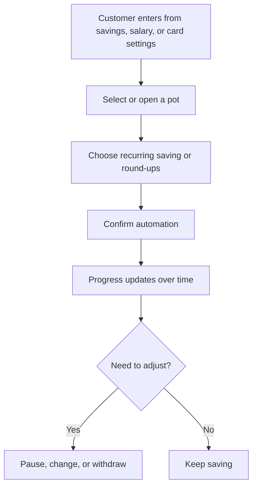

# Savings Pots and Round-Ups

Author: Product
Document Version: 0.3
Document Status: Reviewing
Document Type: PRD

## 1. TL;DR

- This PRD defines an `MMP` expansion of savings pots so customers can keep making progress toward a future life event instead of saving only when they remember.
- The feature is for retail current-account customers who want lightweight goal-based saving inside their primary banking app.
- This stage builds on an existing pots `MVP` that already supports pot creation, manual funding, and withdrawals.
- `MMP` scope adds recurring contributions, card round-ups, clearer progress visibility, contextual entry points, and trust-critical money-movement explanations.
- The main outcome is more customers making repeated progress toward a named savings goal over time.
- The primary success metric is the share of activated customers who make savings progress in two consecutive months.

## 2. Product Shape

| Item | Decision |
| --- | --- |
| `PRD Phase` | `MMP` |
| `Lineage` | Extends an earlier savings-pots `MVP` that already supports pot creation, manual funding, and withdrawals |
| `Product Posture` | Extension of the existing banking app rather than a separate savings product |
| `Adjacent Surfaces` | Home dashboard, account balances, salary deposit moments, card settings, transaction feed |
| `Entry Point Hypothesis` | Customers should encounter the capability from the savings hub, after salary deposits, and when managing card settings |

### 2.1. Assumptions To Test

| # | Assumption | Validation Method | Threshold |
| --- | --- | --- | --- |
| A1 | Customers with automation enabled will contribute more consistently than manual-only pot customers. | Compare month-over-month contribution continuity across cohorts. | Automated cohort is at least 1.5x more likely to contribute in two consecutive months. |
| A2 | Entry points tied to salary and card settings will increase activation versus a savings-hub-only entry model. | Compare activation and setup-completion rates by entry point. | Contextual entry points outperform hub-only entry by at least 20%. |

## 3. Strategic Context

### 3.1. Job To Be Done

| JTBD Lens | Notes |
| --- | --- |
| **Main job** | Put money aside steadily for a future life event or planned purchase without turning saving into another chore. |
| **Current approach** | Customers use manual transfers, spreadsheets, notes apps, cash envelopes, or generic savings accounts with weak progress visibility. |
| **Current friction** | Saving gets skipped, progress feels abstract, and the activity is disconnected from the moments when customers actually have money or spend money. |
| **Desired progress** | Customers should feel that saving is visible, automatic when appropriate, and naturally part of daily banking behavior. |

**Who experiences this:** Retail current-account customers, especially digitally active customers who want lightweight habit-forming tools rather than formal savings-product journeys.

### 3.2. Why This Stage Now

- The `MVP` proves that customers will create and use named pots.
- The next risk is not pot creation, but whether customers keep making progress once the novelty fades.
- This `MMP` focuses on automation, contextual entry points, and trust so the behavior becomes more durable.

### 3.3. Market, Competitive & Substitute Context

| Signal or Alternative | What it says about the job | Implication for {Company XYZ} |
| --- | --- | --- |
| **Current substitutes** | Customers already patch together the job with manual transfers, budgeting tools, separate savings accounts, or offline tracking habits. | {Company XYZ} should reduce setup and follow-through friction. |
| **Market evidence** | The job is common and recurring: customers want help turning intent into repeated action, not just a place to park money. | `MMP` should improve habit formation and discoverability, not only add more controls. |
| **Traditional savings accounts** | They provide separation, but often weak goal framing and weak day-to-day motivation. | Keep the experience goal-led, not account-setup-led. |
| **Digital banks with round-ups and goal pots** | They automate some of the habit, but can feel generic or not aligned to local salary and spending norms. | Lean into current-account context, salary timing, and trust. |

## 4. Goals & Rabbit Holes

### 4.1. What We Want To Achieve

| Goal | Why it matters now |
| --- | --- |
| **Make saving progress feel continuous** | Customers need to see movement toward a real objective, not just a balance in another view. |
| **Reduce dependence on memory** | The step from `MVP` to `MMP` is about building habit loops, not just giving customers a place to save. |
| **Meet customers in the right moments** | Salary moments and card settings are natural places to start or reinforce the saving job. |
| **Keep trust high while money moves automatically** | Automation only works if customers always understand why money moved, when it moved, and how to stop it. |

### 4.2. Rabbit Holes We Will Avoid

| Rabbit Hole | Why it is out of scope now |
| --- | --- |
| **Interest-bearing savings products** | This stage is about helping customers make progress on the saving job, not launching a new financial product structure. |
| **Shared or family pots** | Shared ownership introduces permissions, social UX, and disclosures that do not help prove the core habit loop. |
| **Funding from external bank accounts** | Staying inside the {Company XYZ} ecosystem keeps the experience simpler and more trustworthy at this stage. |
| **Investment-linked goals** | Investing serves a related but different job and belongs in a separate product stream. |

## 5. Functional Requirements

### 5.1. Automated Funding

| ID | Requirement | Priority | Notes |
| --- | --- | --- | --- |
| AF.1 | Allow customers to enable recurring contributions on at least weekly and monthly cadences for an existing or newly created pot. | P0 | This is a core `MMP` behavior. |
| AF.2 | Allow customers to enable card round-ups that move spare change from eligible posted card purchases into a selected pot. | P0 | Round-ups should use posted, not merely authorized, transactions. |
| AF.3 | Allow customers to pause or disable recurring contributions and round-ups without closing the pot. | P0 | Automation must stay easy to control. |
| AF.4 | Notify customers when an automated contribution fails and explain the reason where possible. | P0 | Failure handling is trust-critical. |

### 5.2. Progress And Motivation

| ID | Requirement | Priority | Notes |
| --- | --- | --- | --- |
| PM.1 | Display each pot with current balance, target progress, and latest contribution activity. | P0 | Progress should be visible from the main pots overview. |
| PM.2 | Show a contribution history for each pot. | P1 | Customers should understand how progress is being made over time. |
| PM.3 | Notify customers when a pot reaches its target amount. | P1 | This creates a meaningful completion moment. |
| PM.4 | Surface lightweight nudges when a pot is close to target or has gone inactive. | P1 | Nudges should be configurable and not overly frequent. |

### 5.3. Controls And Transparency

| ID | Requirement | Priority | Notes |
| --- | --- | --- | --- |
| CT.1 | Explain clearly how round-ups work, including transaction timing, refund handling, and when transfers happen. | P0 | Customers should not need to infer the rules. |
| CT.2 | Display available current-account balance and explain that pot funds remain part of the customer's overall balance unless the product structure says otherwise. | P0 | The UI must not imply a different regulated structure. |
| CT.3 | Allow customers to edit pot name, target amount, target date, and funding settings after creation. | P1 | Customers should not need to recreate a pot to refine the goal. |
| CT.4 | Allow customers to withdraw money back to the current account and explain when the funds become spendable. | P0 | Access to funds must stay clear and predictable. |

## 6. Entry Points, Core Journey & Platform Fit

### 6.1. Entry Points & Context

| Entry Point | Why it makes sense |
| --- | --- |
| **Savings Pots** from the app home screen | This remains the default home for explicit saving intent. |
| **Suggested savings** after salary deposit | Customers often decide what they can save when income lands. |
| **Save with round-ups** from card settings | Customers exploring card behavior are already thinking about day-to-day spend. |

### 6.2. Core Journey

| Step | User move | Product response |
| --- | --- | --- |
| 1 | Customer enters from the savings hub, salary prompt, or card settings and selects a pot. | The app shows the pot state and the available automation options that fit the entry point. |
| 2 | Customer enables recurring contributions or round-ups. | The app explains how the automation works, what account it draws from, and how to pause it later. |
| 3 | Customer confirms the setup. | The app saves the funding rule, confirms the next expected contribution behavior, and returns the customer to the pot overview. |
| 4 | Customer continues daily banking behavior. | The app applies eligible recurring contributions or round-ups, updates progress, and surfaces failures or milestones clearly. |

### 6.3. Platform Fit & Adjacent Surfaces

| Consideration | Notes |
| --- | --- |
| **Logical home** | This capability should live inside the current-account experience, not as a separate savings mode. |
| **Adjacent surfaces** | The experience should connect naturally to salary moments, card settings, balance views, and transaction history. |
| **Foundation vs extension** | This is an extension of an existing pots foundation, focused on habit formation rather than net-new account setup. |

### 6.4. Diagram

## 7. Success Metrics & Gates

| Metric | Definition | Target | Measurement | Why it matters |
| --- | --- | --- | --- | --- |
| **Consecutive progress rate** | Percentage of activated customers who contribute to a named pot in two consecutive months | >40% within 12 weeks | Product analytics and transfer reporting | Proves the product is helping customers sustain progress on the saving job. |
| **Funded goal activation rate** | Percentage of eligible customers who create or use at least one funded pot in this stage | >18% within 12 weeks | Product analytics | Shows the `MMP` is reaching customers, not just existing heavy users. |
| **Automation adoption rate** | Percentage of activated customers who enable recurring contributions or round-ups | >35% within 12 weeks | Product analytics | Confirms the new stage features are solving a real need. |
| **Contribution success rate** | Percentage of attempted recurring or round-up contributions completed successfully | >95% | Payments and transfer reporting | Reliability is required for trust. |
| **Withdrawal confusion contact rate** | Support contacts about unavailable funds or unexpected savings transfers | No material increase vs. baseline | Support contact tagging | Guardrail against accidental trust erosion. |

| Gate | Target | Timeframe |
| --- | --- | --- |
| Move from `MMP` toward `MLP` investment | Consecutive progress improves materially, automation adoption is healthy, and trust-related contact rates remain stable | Within 12 weeks of launch |

## 8. Systems, Risks & Compliance

| Area | What matters | Why it matters now |
| --- | --- | --- |
| **Current-account ledger and balance services** | Must reflect real available balances and completed transfers accurately. | Customers will lose trust quickly if the pot view feels inconsistent with spendable balance. |
| **Internal transfer service** | Must support recurring contributions, round-up transfers, withdrawals, and pause or stop controls. | Money movement is the core behavior of this stage. |
| **Card transaction event feed** | Must trigger round-up calculations from eligible posted card activity. | Round-ups fail if the event model is unreliable or poorly timed. |
| **Refund and reconciliation rules** | Refunds, reversals, and partial settlements need explicit handling. | Hidden exceptions here will create visible trust problems later. |
| **Notification infrastructure** | Must support failure alerts, target-reached moments, and nudges. | The `MMP` promise depends on clear feedback loops. |
| **Financial disclosures and transparency** | The app must explain where funds sit, when transfers happen, and what the product is not. | The experience should not imply a separate regulated account unless one exists. |
| **Accessibility and localization** | The experience should support WCAG 2.1 AA expectations and required languages and locales, including RTL where relevant. | Progress indicators and money movement explanations must remain understandable for all users. |

