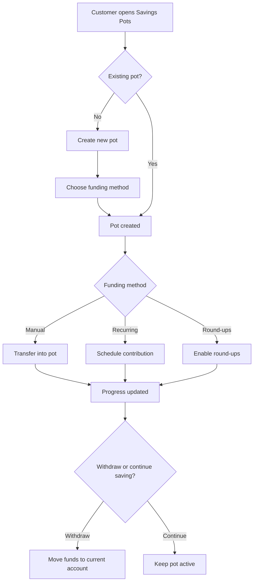

# Savings Pots and Round-Ups

Author: Product
Document Version: 0.1
Document Status: Draft
Document Type: PRD

## 1. TL;DR

- This PRD covers a customer-facing savings feature that lets Mal Bank customers create named savings pots and fund them through manual transfers, recurring transfers, and card round-ups.
- The feature is for retail customers who want lightweight, goal-based saving inside their primary banking app rather than in spreadsheets, notes apps, or separate accounts.
- MVP scope includes pot creation, goal naming, target amount setting, pot funding, round-ups, recurring contributions, progress tracking, withdrawals back to the current account, and nudges.
- The product outcome is a more habitual savings behavior inside the Mal Bank app.
- The business outcome is stronger primary-account engagement and higher retained deposit balances.
- The primary success metric is the number of funded active pots per eligible customer.
- The feature depends on reliable internal transfers, posted card transaction events for round-ups, and clear customer disclosures around fund movement and availability.

## 2. Strategic Context

### 2.1. Problem Statement

| Pain Point | Current Impact |
| --- | --- |
| **Customers want lightweight savings goals, not a separate financial product setup flow** | Many customers save informally or not at all because setting money aside feels manual and easy to skip. |
| **The current app does not help customers build saving habits** | Mal Bank misses a high-frequency engagement loop tied to salary cycles and everyday spending. |
| **Savings intent is disconnected from daily banking activity** | Customers do not see progress in context, and Mal Bank loses the chance to make the current account feel more valuable. |

**Who experiences this:** Retail current-account customers in the UAE, especially digitally active customers who want simple habit-forming tools rather than formal savings products.

### 2.2. Market Opportunity Sizing

All figures are illustrative estimates pending formal market research.

| Segment | Size | Notes |
| --- | --- | --- |
| **TAM** | 5.5M retail banking adults | Bankable adults in the UAE using digital banking channels. |
| **SAM** | 1.2M digitally active current-account customers | Target segment aligned to Mal Bank's mobile-first audience. |
| **SOM (Year 1-2)** | 120k customers | Based on eligible account base and realistic rollout assumptions. |

### 2.3. Competitive Landscape

| Competitor | Strengths | Weaknesses | Our Differentiator |
| --- | --- | --- | --- |
| **Wio Personal** | Strong digital money management positioning and modern UX | Broader proposition can feel finance-heavy rather than habit-focused | Native to the current account, not a separate mode |
| **Liv** | Recognizable retail brand and broad consumer awareness | Saving experiences can feel less goal-led and less personalized | Clearer goal framing and lower-friction setup |
| **Monzo / Revolut** | Strong round-up and savings habit mechanics | Not tailored to UAE banking norms and payroll patterns | Localized for UAE salary cycles, Arabic support, and local trust expectations |

**Unique Selling Proposition:** Mal Bank can make saving feel like a natural extension of the current account, not a separate product journey. A simple setup flow, local salary-cycle relevance, and English and Arabic support should let the feature feel easier to start and easier to maintain than generic budgeting tools.

### 2.4. Key Assumptions to be Tested

| # | Assumption | Validation Method | Threshold |
| --- | --- | --- | --- |
| A1 | Customers will create a pot if setup takes less than 2 minutes | Funnel analysis from pot entry to pot creation | >35% completion rate |
| A2 | Round-ups increase contribution frequency versus manual-only funding | Compare funded-pot cohorts with and without round-ups enabled | Round-up cohort contributes at least 2x as often |
| A3 | Goal naming and progress visibility improve retention | Compare 30-day active-pot retention against baseline savings behaviors | >50% of funded pots remain active after 30 days |

### 2.5. Success Criteria for Program Continuation

| Criterion | Target | Timeframe |
| --- | --- | --- |
| Funded pot activation | >15% of eligible customers create at least one funded pot | Within 12 weeks of general availability |
| Repeat contribution rate | >40% of funded-pot customers make more than one contribution | Within 12 weeks of general availability |
| Complaint rate | No material increase in complaints about unavailable funds or unclear transfers | Within 12 weeks of general availability |

## 3. Goals

### 3.1. Business Goals

| Goal | Target | Timeframe |
| --- | --- | --- |
| Increase primary-account engagement | +10% monthly active usage among eligible customers | Within 2 quarters |
| Increase retained deposit balances | Positive uplift in retained balances among funded-pot customers | Within 2 quarters |
| Improve habit-based product adoption | 1.3 funded pots per activated customer | Within 12 weeks of launch |

### 3.2. User Goals

| Goal | Description |
| --- | --- |
| **Save for something specific** | Customers can create a named goal and see visible progress toward it. |
| **Automate saving** | Customers can fund pots without remembering to transfer money every time. |
| **Access savings easily** | Customers can move money back to the current account without confusion or waiting. |

## 4. Non-Goals

| Non-Goal | Rationale |
| --- | --- |
| Interest-bearing savings products | This PRD is about behavioral saving, not a new regulated deposit product structure. |
| Shared or family pots | Shared ownership adds permissions, disclosures, and social UX complexity that is out of scope for MVP. |
| Funding from external bank accounts | MVP should stay inside the Mal Bank account ecosystem to reduce operational and reconciliation complexity. |
| Investment-linked goals | Wealth and investment journeys are separate product tracks. |

## 5. Functional Requirements

### 5.1. Pot Setup and Management

| ID | Requirement | Priority | Notes |
| --- | --- | --- | --- |
| PS.1 | Allow eligible customers to create a pot with a name, optional target amount, and optional target date. | P0 | Pot setup must be completable in one short flow. |
| PS.2 | Display available current-account balance and explain that pot funds remain part of the customer's overall account balance. | P0 | The UI must not imply a separate regulated account unless one exists. |
| PS.3 | Allow customers to edit pot name, target amount, target date, and funding settings after creation. | P1 | Editing should not require recreating the pot. |

### 5.2. Funding Mechanisms

| ID | Requirement | Priority | Notes |
| --- | --- | --- | --- |
| FM.1 | Allow manual transfers from the current account into a pot. | P0 | Transfers should confirm immediately once successful. |
| FM.2 | Allow recurring contributions on a customer-selected cadence. | P0 | MVP should support at least weekly and monthly schedules. |
| FM.3 | Allow customers to enable card round-ups that transfer the spare change from posted card purchases into a selected pot. | P0 | Round-ups should use posted, not merely authorized, transactions. |
| FM.4 | Allow customers to pause or disable recurring contributions and round-ups without closing the pot. | P0 | Customers need clear control over automation. |

### 5.3. Progress and Visibility

| ID | Requirement | Priority | Notes |
| --- | --- | --- | --- |
| PV.1 | Display each pot with current balance, target progress, and latest contribution activity. | P0 | Progress should be visible from the main pots overview. |
| PV.2 | Show a contribution history for each pot. | P1 | Customers should be able to understand how the balance was built over time. |
| PV.3 | Surface lightweight nudges when a pot is close to target or has gone inactive. | P1 | Nudges should be configurable and not overly frequent. |

### 5.4. Withdrawals and Closure

| ID | Requirement | Priority | Notes |
| --- | --- | --- | --- |
| WC.1 | Allow customers to transfer money from a pot back to the current account. | P0 | The flow must explain when the funds become spendable. |
| WC.2 | Allow customers to close an empty pot. | P0 | Customers should not be blocked from cleaning up unused pots. |
| WC.3 | Prevent pot closure while funds remain in the pot unless the customer first withdraws or transfers the funds. | P0 | This avoids ambiguity about where money goes. |

### 5.5. Notifications and Guidance

| ID | Requirement | Priority | Notes |
| --- | --- | --- | --- |
| NG.1 | Notify customers when a recurring contribution or round-up transfer fails. | P0 | Failure messaging must explain the reason and next action where possible. |
| NG.2 | Notify customers when a pot reaches its target amount. | P1 | This supports a completion moment and future action. |
| NG.3 | Explain clearly how round-ups work, including transaction timing and refund handling. | P0 | This is a trust-critical requirement. |

## 6. User Experience

### 6.1. Entry Points

| Action | Function |
| --- | --- |
| **Savings Pots** from the app home screen | Opens the pots overview and creation flow. |
| **Save with round-ups** prompt in card settings | Opens setup for selecting a destination pot and enabling round-ups. |
| **Suggested savings** card after salary deposit | Opens pot creation with a recommended starting template. |

### 6.2. Core Experience Flows

#### 6.2.1. Create a New Pot

**Entry:** Customer taps **Create Pot** from the pots overview.

| Step | User Action | System Response |
| --- | --- | --- |
| 1 | Customer starts pot creation. | The system shows fields for pot name, optional target amount, and optional target date. |
| 2 | Customer enters the pot details and continues. | The system validates the input and moves to funding setup. |
| 3 | Customer chooses manual-only, recurring contributions, or round-ups. | The system shows the relevant controls and explanatory copy. |
| 4 | Customer confirms the setup. | The system creates the pot and shows it in the overview. |

#### 6.2.2. Enable Round-Ups on an Existing Pot

**Entry:** Customer opens an existing pot and selects **Round-Ups**.

| Step | User Action | System Response |
| --- | --- | --- |
| 1 | Customer enables round-ups. | The system explains how round-ups are calculated and when transfers happen. |
| 2 | Customer confirms the destination pot. | The system saves the setting and shows the next expected round-up behavior. |
| 3 | Customer continues using their card. | The system transfers round-up amounts after eligible card transactions are posted. |

#### 6.2.3. Withdraw Money From a Pot

**Entry:** Customer opens a pot and taps **Withdraw**.

| Step | User Action | System Response |
| --- | --- | --- |
| 1 | Customer enters an amount to withdraw. | The system validates the amount against the pot balance. |
| 2 | Customer confirms the withdrawal. | The system moves the funds back to the current account and confirms availability timing. |
| 3 | Customer returns to the pots overview. | The system updates the pot progress and current-account balance. |

### 6.3. Edge Cases

| Scenario | System Behavior |
| --- | --- |
| **Card transaction is later refunded** | The round-up logic should reverse or reconcile the related spare-change transfer according to defined refund rules. |
| **Recurring contribution would overdraw the account** | The transfer should fail gracefully, leave the pot unchanged, and notify the customer. |
| **Customer withdraws the full balance** | The pot remains open unless the customer explicitly closes it. |
| **Pot target date passes before the target is reached** | The pot remains active and prompts the customer to keep, edit, or close the goal. |

### 6.4. UI/UX Highlights

| Aspect | Implementation |
| --- | --- |
| **Progress visibility** | Each pot should show a clear progress state, not just a balance figure. |
| **Transparency** | Customers should always understand whether money is moved immediately, later, or not at all. |
| **Localization** | The full experience should support English and Arabic, including RTL layouts where required. |
| **Accessibility** | The experience should meet WCAG 2.1 AA expectations for contrast, text scaling, and assistive technology support. |

## 7. Flow Diagram

## 8. Success Metrics

The activation and repeat-contribution targets below align with the continuation criteria in §2.5.

| Metric | Definition | Target | Measurement |
| --- | --- | --- | --- |
| **Funded pot activation rate** | Percentage of eligible customers who create at least one pot and fund it | >15% within 12 weeks | Product analytics |
| **Funded active pots per activated customer** | Average number of funded pots among customers who activate the feature | >1.3 | Product analytics |
| **Repeat contribution rate** | Percentage of funded-pot customers making more than one contribution | >40% within 12 weeks | Transfer and event analysis |
| **Round-up adoption rate** | Percentage of activated customers enabling round-ups | >30% within 12 weeks | Product analytics |
| **Withdrawal confusion contact rate** | Support contacts related to pot withdrawal timing or missing funds | No material increase vs. baseline | Support contact tagging |
| **Contribution success rate** | Percentage of attempted recurring or round-up contributions completed successfully | >95% | Payments and transfer reporting |

## 9. Technical Considerations

### 9.1. Existing Systems and Dependencies

| System or Capability | Current State | Relevance to This PRD |
| --- | --- | --- |
| **Current-account ledger** | Existing source of customer balances and internal transfer movement | Pots must reflect real available balances and completed transfers accurately. |
| **Internal transfer service** | Existing service for moving funds within Mal Bank accounts | Used for manual funding, recurring transfers, and withdrawals. |
| **Card transaction event feed** | Existing transaction stream for posted card activity | Required to calculate and trigger round-up transfers reliably. |
| **Push notification infrastructure** | Existing notification capability | Used for contribution failures, target completion, and inactivity nudges. |

### 9.2. Integration Points

| System | Integration Type | Purpose |
| --- | --- | --- |
| **Ledger and balance services** | API | Read balances and reflect pot-linked fund movement accurately. |
| **Internal transfer service** | API | Execute pot funding, recurring transfers, and withdrawals. |
| **Card event stream** | Event-driven | Trigger round-up calculations after eligible posted card transactions. |
| **Notification service** | API/Event-driven | Send savings-related nudges and failure notifications. |

### 9.3. Gaps, Constraints, and Risks

| Item | Type | Notes |
| --- | --- | --- |
| **Round-up reconciliation rules** | Gap | Refunds, reversals, and partial settlements need explicit handling before build starts. |
| **Balance presentation risk** | Risk | Customers may misunderstand pot balances if the app implies a separate account structure that does not exist. |
| **Contribution timing edge cases** | Constraint | Recurring and round-up transfers need clear customer messaging if they do not happen instantly. |
| **Notification fatigue** | Risk | Overusing nudges could reduce trust or prompt customers to disable notifications entirely. |

## 10. Data & Compliance Considerations

| Area | Requirement or Consideration | Notes |
| --- | --- | --- |
| **UAE PDPL** | Use only the personal data needed to power the savings experience and communications. | Pot personalization should not introduce unnecessary personal-data collection. |
| **CBUAE and product disclosure expectations** | Present savings behavior clearly and avoid implying a separate regulated account if funds remain within the current-account structure. | Copy and disclosures should be reviewed with compliance and legal. |
| **Transaction transparency** | Customers must be able to understand why a transfer happened, when it happened, and where the funds sit now. | This is especially important for round-ups and failed contributions. |
| **Accessibility** | The experience should meet WCAG 2.1 AA expectations. | Savings progress, charts, and labels should remain understandable without relying only on color. |
| **Localization** | The experience should support English and Arabic, including RTL layouts. | Amount formatting and goal copy should be localized appropriately. |

## 11. Epics Breakdown

| # | Epic Name | Description |
| --- | --- | --- |
| 1 | **Pots Foundation** | Create the pot object model, customer eligibility checks, and overview experience. |
| 2 | **Pot Creation and Management** | Support setup, editing, and closure of savings pots. |
| 3 | **Funding Mechanisms** | Implement manual funding, recurring contributions, and controls to pause or resume automation. |
| 4 | **Round-Ups Engine** | Calculate spare-change transfers from posted card transactions and handle reconciliation cases. |
| 5 | **Withdrawals and Transparency** | Support withdrawals back to the current account with clear balances and messaging. |
| 6 | **Notifications and Customer Guidance** | Deliver nudges, failure notifications, and explanatory guidance for trust-critical flows. |
| 7 | **Compliance, Localization, and Accessibility** | Deliver the disclosures, control points, localization, and accessibility work needed for release. |
