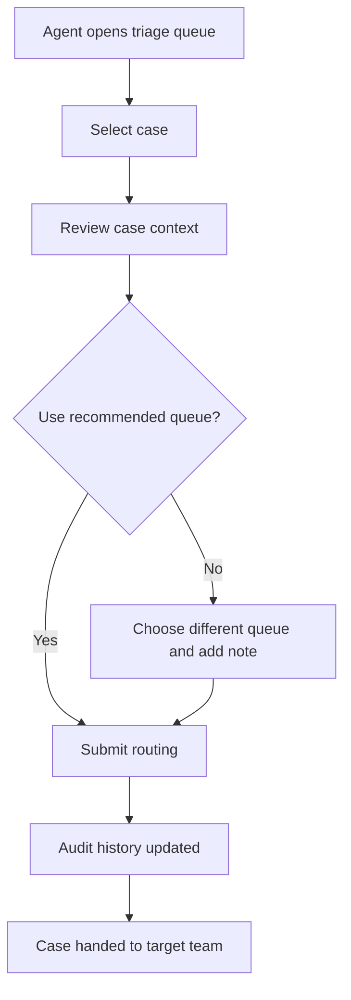

# Support Operations Triage Console

Author: Product Ops
Document Version: 0.1
Document Status: Draft
Document Type: PRD

## 1. TL;DR

- This PRD covers an internal console for support agents to triage inbound customer cases faster and route them to the correct downstream team.
- The MVP is for customer support and operations users inside Mal Bank.
- MVP scope includes a unified case queue, case detail view, recommended routing, manual reassignment, and audit history.
- The main user outcome is faster, more consistent triage with fewer cases bouncing between teams.
- The primary business outcome is reduced operational handling time and lower rework.
- The primary success metric is median triage time per case.
- The console depends on reliable case ingestion from the existing support platform and customer data services.

## 2. Strategic Context

### 2.1. Problem Statement

| Pain Point | Current Impact |
| --- | --- |
| **Agents triage cases across several tools** | Time is lost switching between screens before the agent can decide who should own the case. |
| **Routing decisions are inconsistent** | Cases are frequently reassigned, creating delays for customers and extra work for specialist teams. |
| **Audit history is fragmented** | Team leads cannot easily understand why a case was routed or who changed ownership. |

**Who experiences this:** Tier 1 support agents, operations analysts, complaints specialists, and support team leads.

## 3. Goals

### 3.1. Business Goals

| Goal | Target | Timeframe |
| --- | --- | --- |
| Reduce median triage time per case | -35% | Within 8 weeks of launch |
| Reduce reassignment rate after first routing decision | -25% | Within 8 weeks of launch |
| Improve case handling auditability | 100% of triage actions logged | At launch |

### 3.2. User Goals

| Goal | Description |
| --- | --- |
| **See enough context quickly** | Agents can understand the case without opening several supporting tools. |
| **Route with confidence** | Agents can assign the case to the correct queue on the first pass. |
| **Explain past decisions** | Team leads can review routing history and understand what happened. |

## 4. Non-Goals

| Non-Goal | Rationale |
| --- | --- |
| Full case resolution workflow | The console is for triage and routing, not end-to-end handling. Resolution remains in the existing support platform. |
| Automated customer responses | Response generation belongs in a separate support tooling stream. |
| Workforce management and staffing views | Capacity planning is a different operational problem and should not expand the MVP scope. |

## 5. Functional Requirements

### 5.1. Unified Queue

| ID | Requirement | Priority | Notes |
| --- | --- | --- | --- |
| UQ.1 | Display all new inbound cases in a single queue with current status, source, urgency, and created time. | P0 | The queue is the default landing view after sign-in. |
| UQ.2 | Allow agents to filter the queue by source, priority, category, and assigned team. | P0 | Filters must persist during the user session. |
| UQ.3 | Support free-text search by case ID, customer ID, and customer name. | P1 | Name search must respect access permissions and masking rules. |

### 5.2. Case Review Workspace

| ID | Requirement | Priority | Notes |
| --- | --- | --- | --- |
| CR.1 | Display a case detail view with issue summary, customer profile, recent account activity, and previous contacts. | P0 | The view should consolidate existing data, not create a new source of truth. |
| CR.2 | Show the current recommended destination queue based on case metadata and routing rules. | P0 | Recommendations are advisory in MVP. |
| CR.3 | Display visible warnings for complaints, vulnerable customer markers, and fraud-related indicators. | P0 | These markers affect triage priority and routing. |

### 5.3. Routing and Handoff

| ID | Requirement | Priority | Notes |
| --- | --- | --- | --- |
| RH.1 | Allow the agent to assign a case to a target queue and include a routing note. | P0 | Routing note is mandatory when the agent overrides the recommendation. |
| RH.2 | Prevent a case from being assigned by two users at the same time without a visible conflict message. | P0 | The user should be prompted to refresh and review the latest state. |
| RH.3 | Allow team leads to reassign a case after initial routing. | P1 | Restricted to elevated permissions. |

### 5.4. Audit and Oversight

| ID | Requirement | Priority | Notes |
| --- | --- | --- | --- |
| AO.1 | Log every routing action, reassignment, note, and queue status change with timestamp and user ID. | P0 | Audit history must be immutable. |
| AO.2 | Display the full triage history inside the case view. | P0 | Users should not need a separate audit tool for normal review. |
| AO.3 | Provide a basic reporting view for triage time, reassignment rate, and queue backlog by team. | P1 | A lightweight in-product view is enough for MVP. |

## 6. User Experience

### 6.1. Entry Points

| Action | Function |
| --- | --- |
| **Operations Console** from the internal tool launcher | Opens the triage queue landing page. |
| **Open in Triage Console** from the support platform | Deep-links a specific case into the case review workspace. |

### 6.2. Core Experience Flows

#### 6.2.1. Triage a New Case

**Entry:** Agent opens the triage queue from the internal tool launcher.

| Step | User Action | System Response |
| --- | --- | --- |
| 1 | Agent selects an unassigned case from the queue. | The system opens the case review workspace with customer and case context loaded. |
| 2 | Agent reviews the issue summary, recent activity, and recommendation. | The system displays warnings, recommended destination queue, and prior contact history. |
| 3 | Agent confirms the recommended queue or selects a different queue. | The system requires a routing note if the recommendation is overridden. |
| 4 | Agent submits the routing decision. | The system assigns the case, records the audit event, and removes the case from the unassigned queue. |

#### 6.2.2. Review a Reassignment Request

**Entry:** Team lead opens a case from the reporting or queue view.

| Step | User Action | System Response |
| --- | --- | --- |
| 1 | Team lead opens the case history. | The system shows the original routing decision and any follow-up actions. |
| 2 | Team lead decides the case should move to a different specialist queue. | The system allows reassignment for users with elevated permissions. |
| 3 | Team lead adds a reassignment reason and confirms. | The system updates ownership and appends a new immutable history item. |

### 6.3. Edge Cases

| Scenario | System Behavior |
| --- | --- |
| **Customer profile service is temporarily unavailable** | The case opens with core case data, shows a warning banner, and allows routing if the missing data is not mandatory. |
| **Another user assigns the case first** | The system blocks the stale submission and prompts the user to refresh the case state. |
| **Case contains restricted PII** | The system masks sensitive fields based on the user's role and logs every unmask action where applicable. |

### 6.4. UI/UX Highlights

| Aspect | Implementation |
| --- | --- |
| **High-density workflow** | Support keyboard shortcuts for common actions (open case, confirm routing, submit note) so agents can triage without switching to the mouse. |
| **Accessibility** | Internal users should still get keyboard navigation, visible focus states, and readable contrast. |

## 7. Flow Diagram

## 8. Success Metrics

| Metric | Definition | Target | Measurement |
| --- | --- | --- | --- |
| **Median triage time** | Median elapsed time between case appearing in the queue and first routing decision | -35% vs. current baseline | Product analytics and support ops reporting |
| **First-pass routing accuracy** | Percentage of cases not reassigned within 24 hours of first routing | >85% | Queue history analysis |
| **Reassignment rate** | Percentage of cases moved to a different queue after initial triage | <15% | Audit history analysis |
| **Time to first action** | Time from case creation to first human triage action | -25% vs. current baseline | Support platform timestamps |
| **Workspace load time** | Time for case review workspace to load all core context | <2.5 seconds for p95 | Frontend performance monitoring |

## 9. Technical Considerations

### 9.1. Existing Systems and Dependencies

| System or Capability | Current State | Relevance to This PRD |
| --- | --- | --- |
| **Support platform** | Existing source of inbound cases and case metadata | Supplies the base case object and deep-link entry point. |
| **Customer profile service** | Existing internal service for profile and account summary data | Provides supporting context during triage. |
| **Case routing rules** | Rules currently live in agent guidance docs and team habits | Need to be codified into a maintainable rules service or config layer. |

### 9.2. Integration Points

| System | Integration Type | Purpose |
| --- | --- | --- |
| **Support platform** | API | Read new cases and write routing outcomes back to the case record. |
| **Customer profile service** | API | Show relevant customer and account context in the review workspace. |
| **Authentication and RBAC** | Existing internal auth service | Restrict access to reassignment, complaint data, and sensitive fields. |

### 9.3. Gaps, Constraints, and Risks

| Item | Type | Notes |
| --- | --- | --- |
| **Routing logic is not centralized today** | Gap | The MVP needs one owned rule source or recommendation quality will be inconsistent. |
| **Support platform API limits** | Constraint | Bulk queue refresh must avoid aggressive polling. |
| **Inconsistent case category quality** | Risk | Poor inbound metadata could reduce recommendation quality and make manual review slower. |

## 10. Data & Compliance Considerations

| Area | Requirement or Consideration | Notes |
| --- | --- | --- |
| **Data Protection** | Expose only the customer fields needed for triage. | The console should not duplicate or persist unnecessary PII beyond audit needs. |
| **Access Control** | Apply role-based access for complaints, fraud markers, and reassignment functions. | Sensitive case types should only be visible to the right user groups. |
| **Auditability** | Log every routing decision, reassignment, and note change. | Audit history must support internal review and operational controls. |
| **Retention** | Respect existing case retention rules rather than introducing a new retention model. | The console should defer to the source system where possible. |

## 11. Epics Breakdown

| # | Epic Name | Description |
| --- | --- | --- |
| 1 | **Queue Foundation** | Build the unified queue, filtering, and search experience. |
| 2 | **Case Review Workspace** | Build the case detail view with customer context and warning states. |
| 3 | **Routing and Reassignment** | Support routing actions, override notes, conflict handling, and restricted reassignment. |
| 4 | **Audit and Reporting** | Capture triage history and expose basic operational reporting. |
| 5 | **Permissions and Compliance Controls** | Apply RBAC, masking, and audit controls required for internal use. |
