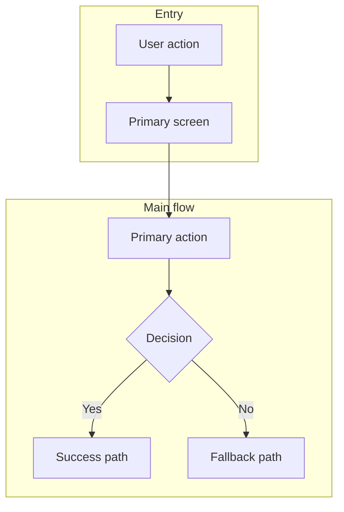

# PRD Reference Guide

This guide is for writing nearly-build-ready Product Requirement Documents (PRDs) for Mal Bank features.

The bias is toward clarity over completeness. A good PRD gives stakeholders enough context to align, gives delivery teams enough direction to break the work into backlog items, and avoids dragging backlog-level detail into the document itself.

This file is the reference guide. For worked examples, see:
- `examples/example-prd-internal-tool.md`
- `examples/example-prd-customer-facing.md`

## What Good Looks Like

A strong PRD should:
- explain the problem and why it matters
- define the scope of the MVP clearly
- make the main user journeys unambiguous
- identify the systems, constraints, and compliance obligations that matter
- define success in measurable terms
- break the work into epics without dropping into user stories and acceptance criteria

Avoid:
- long narrative sections
- tracking plans and event taxonomies
- user stories and acceptance criteria
- technical design detail that belongs in engineering discovery
- optional sections included only because the template had a slot for them

## Core Vs. Optional

Every PRD should have a mandatory core. Optional sections should only appear when they materially improve decision-making.

### Core Sections

All PRDs must include:

1. `TL;DR`
2. `Strategic Context`
3. `Goals`
4. `Non-Goals`
5. `Functional Requirements`
6. `User Experience`
7. `Flow Diagram`
8. `Success Metrics`
9. `Technical Considerations`
10. `Data & Compliance Considerations`
11. `Epics Breakdown`

### Optional Sections

Add these only when they are useful:
- `Market Opportunity Sizing`
- `Competitive Landscape`
- `Key Assumptions to be Tested`
- `Success Criteria for Program Continuation`
- `Expanded Edge Cases`
- `Deep Technical Detail`

For external, customer-facing products:
- `Market Opportunity Sizing` is mandatory
- `Competitive Landscape` is mandatory

For internal tools:
- both are usually unnecessary unless there is a strong decision-making reason to include them

## Document Header

Use a simple header:

```markdown
# [Feature Name]

Author: [Name]
Document Version: [Version Number]
Document Status: [Draft | Review | Approved | In Development]
Document Type: PRD
```

## Core PRD Structure

### 1. TL;DR

**Purpose:** Give a stakeholder the document in under 30 seconds.

**Length guidance:** 5-8 bullets.

**Include:**
- what the feature does
- who it is for
- what is in MVP
- the main user or business outcome
- the primary success metric
- the most important dependency or constraint, if one materially affects delivery

**Avoid:**
- paragraphs
- implementation detail
- duplicate wording from later sections

### 2. Strategic Context

Start with the problem, then add optional strategic layers if they help.

#### 2.1. Problem Statement

Use a table to show pain points and impact:

```markdown
| Pain Point | Current Impact |
| --- | --- |
| **[Problem]** | [Specific impact on users or business] |
```

Follow with:

```markdown
**Who experiences this:** [Target user description]
```

#### 2.2. Market Opportunity Sizing

Optional for internal tools. Mandatory for external, customer-facing products.

```markdown
| Segment | Size | Notes |
| --- | --- | --- |
| **TAM** | [Number] | Total addressable market |
| **SAM** | [Number] | Serviceable addressable market |
| **SOM (Year 1-2)** | [Number] | Serviceable obtainable market |
```

#### 2.3. Competitive Landscape

Optional for internal tools. Mandatory for external, customer-facing products.

```markdown
| Competitor | Strengths | Weaknesses | Our Differentiator |
| --- | --- | --- | --- |
```

End with:

```markdown
**Unique Selling Proposition:** [2-3 sentences]
```

#### 2.4. Key Assumptions to be Tested

Use when the proposition depends on behavior or operational assumptions that still need validation.

```markdown
| # | Assumption | Validation Method | Threshold |
| --- | --- | --- | --- |
| A1 | [Assumption] | [How we'll test it] | [Success criteria] |
```

#### 2.5. Success Criteria for Program Continuation

Use when the team needs an explicit continuation gate after launch or pilot.

```markdown
| Criterion | Target | Timeframe |
| --- | --- | --- |
```

### 3. Goals

#### 3.1. Business Goals

```markdown
| Goal | Target | Timeframe |
| --- | --- | --- |
```

#### 3.2. User Goals

```markdown
| Goal | Description |
| --- | --- |
| **[Goal name]** | [What the user wants to achieve] |
```

### 4. Non-Goals

Explicitly state what is out of scope and why.

```markdown
| Non-Goal | Rationale |
| --- | --- |
| [Feature or scope] | [Why it is excluded; where it belongs] |
```

### 5. Functional Requirements

Organize requirements by major feature area.

```markdown
## 5.X. [Feature Area Name]

| ID | Requirement | Priority | Notes |
| --- | --- | --- | --- |
| FX.1 | [Requirement description] | P0/P1 | [Additional context] |
```

**Priority guidance:**
- `P0`: Must-have for MVP. The feature does not work without it.
- `P1`: Important but not blocking for first release.

Aim for:
- concrete product behavior
- language that is testable
- enough detail for backlog creation

Avoid:
- user stories
- acceptance criteria
- deeply technical implementation choices unless they change the product behavior

### 6. User Experience

Focus on the few journeys that matter most.

#### 6.1. Entry Points

```markdown
| Action | Function |
| --- | --- |
| **[Button or link]** | [What it does] |
```

#### 6.2. Core Experience Flows

For each main flow:

```markdown
#### 6.2.X. [Flow Name]

**Entry:** [How the user initiates this flow]

| Step | User Action | System Response |
| --- | --- | --- |
| 1 | [What user does] | [What system does] |
| 2 | [Next action] | [Next response] |
```

Use step numbers like `4a` and `4b` for branching.

#### 6.3. Edge Cases

Keep this short. Only include edge cases likely to affect scope, trust, or compliance.

```markdown
| Scenario | System Behavior |
| --- | --- |
| **[Edge case]** | [How the system handles it] |
```

#### 6.4. UI/UX Highlights

Capture only product-relevant UX constraints and expectations.

```markdown
| Aspect | Implementation |
| --- | --- |
| **Accessibility** | [Expectation or standard] |
| **Localization** | [Language or RTL needs] |
```

### 7. Flow Diagram

Every PRD should include at least one Mermaid diagram showing the main journey.



**Best practices:**
- show the main journey, not every possible branch
- split into multiple diagrams if one becomes hard to read
- use dotted lines `-.->` for explicitly out-of-scope items when useful

### 8. Success Metrics

Keep this tight. Most PRDs only need 3-7 meaningful metrics.

```markdown
| Metric | Definition | Target | Measurement |
| --- | --- | --- | --- |
| **[Metric name]** | [How measured] | [Target] | [Tool or method] |
```

Use whichever mix is relevant:
- user metrics
- business metrics
- technical metrics

### 9. Technical Considerations

This section should focus on existing systems, tooling, integrations, constraints, and known gaps.

#### 9.1. Existing Systems and Dependencies

```markdown
| System or Capability | Current State | Relevance to This PRD |
| --- | --- | --- |
| **[System]** | [Existing setup] | [Why it matters] |
```

#### 9.2. Integration Points

```markdown
| System | Integration Type | Purpose |
| --- | --- | --- |
| **[External or internal system]** | [API/SDK/Event-driven] | [Why we integrate] |
```

#### 9.3. Gaps, Constraints, and Risks

```markdown
| Item | Type | Notes |
| --- | --- | --- |
| **[Gap or risk]** | Constraint/Risk/Dependency | [Why it matters] |
```

This section is not for full solution design. It is for identifying what already exists, what must be connected, and what could block delivery.

### 10. Data & Compliance Considerations

This section should cover the obligations that meaningfully affect product and delivery decisions.

```markdown
| Area | Requirement or Consideration | Notes |
| --- | --- | --- |
| **Data Protection** | [Requirement] | [Implementation implication] |
| **Financial Services Regulation** | [Requirement] | [Implementation implication] |
```

Consider including, when relevant:
- UAE PDPL
- CBUAE requirements
- accessibility standards such as WCAG 2.1 AA
- language support, including Arabic and RTL
- role-based access and audit logging for internal tools
- data minimization, retention, and consent requirements

### 11. Epics Breakdown

This is mandatory. A PRD should be ready to break into delivery work, and epics are the right level for that handoff.

```markdown
| # | Epic Name | Description |
| --- | --- | --- |
| 1 | **[Epic]** | [Brief description of scope] |
```

Aim for:
- enough coverage that no major scope is missing
- enough compression that backlog work still happens downstream

## Writing Style Guidelines

### General Principles

1. **Lead with what to do, then explain why**
   - Good: "Display account status when the card is frozen so the customer understands why payments are blocked."
   - Bad: "To help customers understand what is going on, the app should probably show if the card is frozen."

2. **Use headings that say something**
   - Good: "Allow customers to pause round-ups without closing the pot"
   - Bad: "Round-up settings"

3. **Be specific**
   - Good: "Generate the PDF in less than 5 seconds"
   - Bad: "Generate the PDF quickly"

4. **Stay out of backlog detail**
   - Put product requirements and epic structure here
   - Put user stories, acceptance criteria, and event taxonomies downstream

### Formatting Standards

**Code and UI elements:**
- use `backticks` for event names, states, endpoints, and code-like identifiers
- use **bold** for UI elements, screens, and emphasis

**Lists and tables:**
- use bullets for short lists
- use numbered lists for ordered steps
- use tables when comparing several attributes across several items

**Language:**
- use American spelling
- use serial commas
- avoid calling work "easy" or "simple"
- avoid "we" when describing product behavior; use "Mal Bank", "the app", or the relevant team name

## Mal Bank Specific Context

### Compliance Requirements

Always include when relevant:
- CBUAE regulations
- UAE PDPL
- WCAG 2.1 AA accessibility standards
- multi-language support, including English and Arabic with RTL where needed

### Standard Tech Stack

Reference these when applicable:
- **Frontend:** React Native
- **Backend:** TypeScript microservices
- **Database:** PostgreSQL
- **Core Banking:** SaaScada
- **Card Management:** Paymentology
- **Cloud:** AWS (Dubai region)
- **Architecture:** Microservices

### Default Audience Assumptions

Use when the PRD does not define a narrower audience:
- tech-savvy expat professionals in the UAE
- UAE residents, including locals and long-term expats
- digitally-first banking customers
- users who expect a modern mobile-first experience

### Common Integration Points

Reference these when applicable:
- SaaScada for core banking operations
- account management systems for account controls
- push notification infrastructure
- SMS gateway for alerts
- biometric and MPin authentication
- OTP service for fallback authentication

## PRD Review Checklist

Before marking a PRD ready for review:

- [ ] All core sections are present
- [ ] The `TL;DR` is brief and useful, not a mini-PRD
- [ ] The problem, goals, and non-goals are all clear
- [ ] Functional requirements are prioritized and specific
- [ ] Core flows are documented clearly enough to hand into backlog creation
- [ ] A Mermaid diagram shows the main journey
- [ ] Success metrics are measurable and limited to the ones that matter
- [ ] Technical considerations identify existing systems, integrations, and meaningful gaps
- [ ] Data and compliance considerations cover the obligations that affect scope or delivery
- [ ] Epics cover the planned scope without dropping into stories and acceptance criteria
- [ ] Optional sections are included only when they genuinely help
- [ ] External, customer-facing PRDs include market sizing and competitive context

## Quick Reference

### Priority Levels

| Priority | Meaning | When to Use |
| --- | --- | --- |
| `P0` | Must-have for MVP | Core functionality, feature broken without it |
| `P1` | Important but not blocking | Strong UX or operational value, can ship later if needed |

### Recommended Length

| Section | Guidance |
| --- | --- |
| `TL;DR` | 5-8 bullets |
| Problem, goals, and non-goals | 3-5 bullets or rows per subsection |
| Functional requirements | 5-12 requirements for a smaller PRD, more only when justified |
| Core flows | 1-3 main flows |
| Success metrics | 3-7 metrics |
| Epics | 3-8 epics in most cases |
